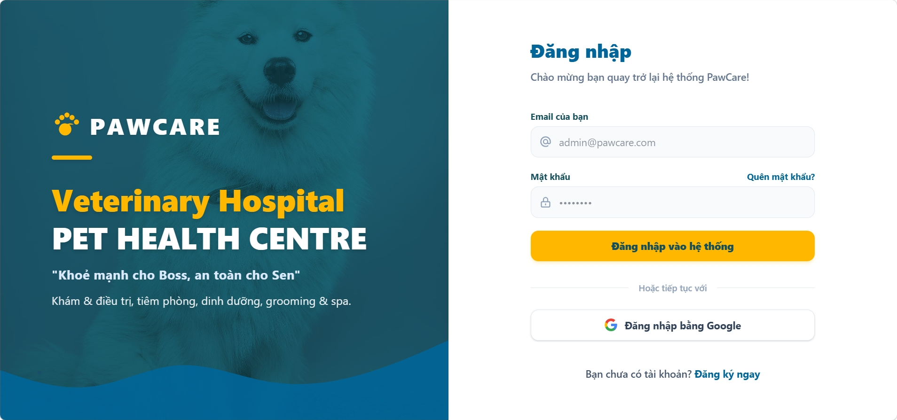
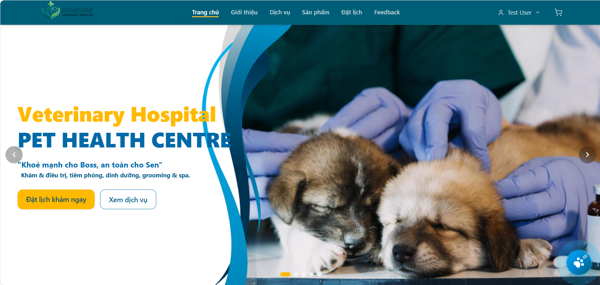
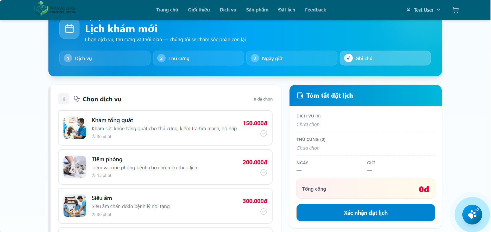
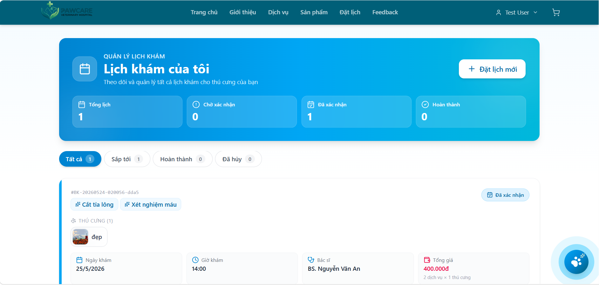
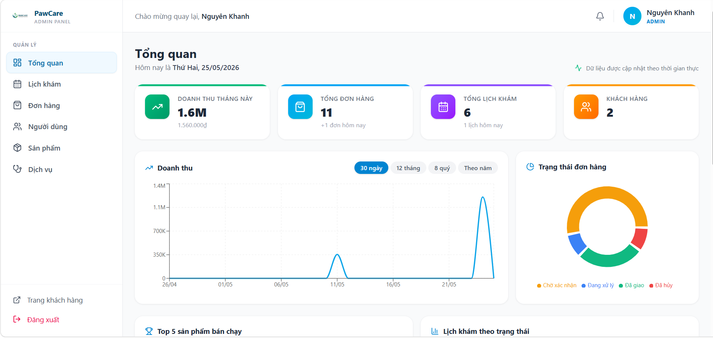
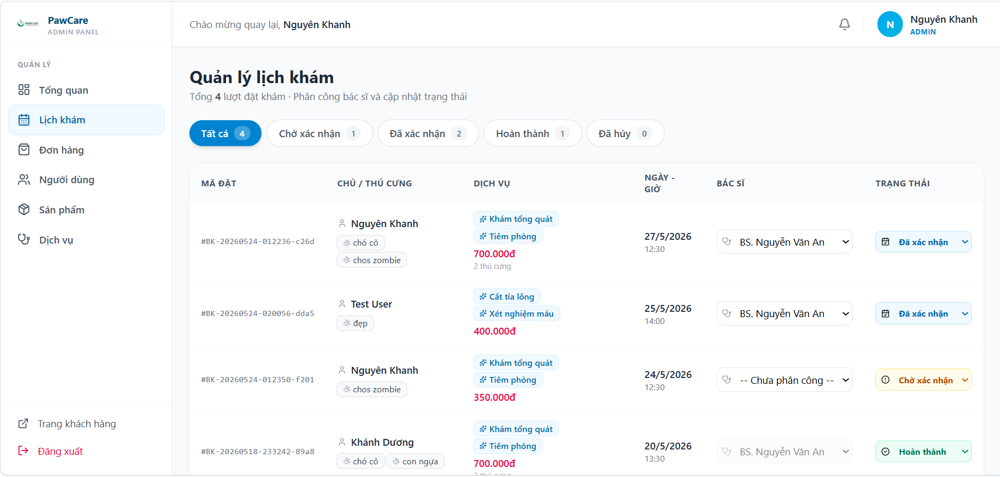
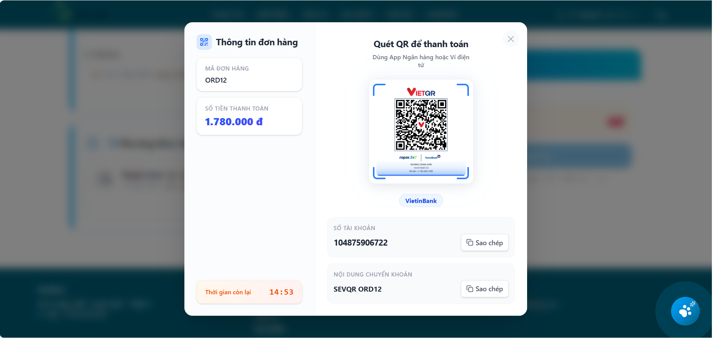

# 🐾 PawCare — Veterinary Clinic Management System

A full-stack web application for managing a veterinary clinic — covering appointment booking, medical records, e-commerce, and online payment.

---

## 📸 Screenshots

> *(Add screenshots here)*

| Login & Register | Home |
|---|---|
|  |  |

| Book Appointment | My Appointments |
|---|---|
|  |  |

| Admin Dashboard | Admin Appointments |
|---|---|
|  |  |

| Doctor Dashboard | QR Payment |
|---|---|
|  |  |

---

## ✨ Features

### Authentication & Authorization
- Email/Password login with **JWT** (30-day expiration)
- **Google OAuth2** single sign-on
- **Role-based access control** — 3 roles: `USER`, `ADMIN`, `DOCTOR`
- Account lock/unlock by admin

### Appointment Booking
- Book appointments for **multiple pets** in a single session
- Select **multiple services** per appointment
- Appointments grouped by `bookingCode` for easy management
- Cancel appointment (blocks cancellation if status is COMPLETED)

### Medical Records
- Auto-created medical record per appointment
- Doctors fill in: diagnosis, treatment, prescription, follow-up date
- Users can view full medical history per pet

### E-Commerce
- Browse and filter products by category
- Shopping cart with stock validation
- Order management with status tracking (PENDING → CONFIRMED → SHIPPED → DELIVERED)

### Payment
- **VietQR** payment link generated on checkout
- **SePay webhook** auto-detects bank transfer and marks order as PAID
- Amount verification to prevent partial/incorrect payments

### AI Chatbot
- Integrated **Groq API (Llama 3.1)** for customer support
- Answers questions about services, pricing, and booking guidance

### Admin Dashboard
- Revenue chart by day / month / quarter / year
- Manage users (view, change role, lock/unlock)
- Manage orders (view, update status)
- Manage appointments (assign doctor, update status)

### Doctor Dashboard
- View assigned appointments
- Mark appointments as COMPLETED
- Write and update medical records

---

## 🛠️ Tech Stack

### Backend
| Technology | Usage |
|---|---|
| Java 17 + Spring Boot 3 | Core framework |
| Spring Security + JWT | Authentication & authorization |
| Spring OAuth2 Client | Google login |
| Spring Data JPA + Hibernate | ORM & database access |
| PostgreSQL | Relational database |
| BCrypt | Password hashing |
| Groq API | AI chatbot (Llama 3.1) |
| VietQR + SePay | QR payment & webhook |

### Frontend
| Technology | Usage |
|---|---|
| React 18 + TypeScript | UI framework |
| Tailwind CSS | Styling |
| Vite | Build tool |
| React Router v6 | Client-side routing |
| Context API | State management (Auth, Cart, Toast) |

---

## 🏗️ System Architecture

```
┌─────────────────┐         ┌──────────────────────┐
│   React + TS    │ ──JWT── │   Spring Boot API    │
│  (port 5173)    │ ───────▶│   (port 8080)        │
└─────────────────┘         └──────────┬───────────┘
                                        │
                          ┌─────────────┼─────────────┐
                          │             │             │
                   ┌──────▼─────┐ ┌────▼────┐ ┌─────▼──────┐
                   │ PostgreSQL │ │  Groq   │ │   SePay    │
                   │            │ │   API   │ │  Webhook   │
                   └────────────┘ └─────────┘ └────────────┘
```

---

## 🚀 Getting Started

### Prerequisites
- Java 17+
- Node.js 18+
- PostgreSQL 15+

### 1. Clone the repository
```bash
git clone https://github.com/your-username/pawcare.git
cd pawcare
```

### 2. Setup Backend

Create a `.env` file or set the following environment variables:

```env
SPRING_DATASOURCE_URL=jdbc:postgresql://localhost:5432/petclinic
SPRING_DATASOURCE_USERNAME=postgres
SPRING_DATASOURCE_PASSWORD=your_password

GOOGLE_CLIENT_ID=your_google_client_id
GOOGLE_CLIENT_SECRET=your_google_client_secret

JWT_SECRET=your_jwt_secret_at_least_32_characters

GROQ_API_KEY=your_groq_api_key

SEPAY_API_KEY=your_sepay_api_key
SEPAY_ACCOUNT_NUMBER=your_bank_account_number
SEPAY_ACCOUNT_NAME=your_account_name
SEPAY_BANK_CODE=your_bank_code
```

Run the backend:
```bash
cd backend_pet
./mvnw spring-boot:run
```

The API will be available at `http://localhost:8080`

### 3. Setup Frontend

```bash
cd fontend_pet
npm install
npm run dev
```

The app will be available at `http://localhost:5173`

---

## 📁 Project Structure

```
pawcare/
├── backend_pet/
│   └── src/main/java/com/example/backend_pet/
│       ├── config/          # Security, JWT, CORS, GlobalExceptionHandler
│       ├── controller/      # REST API endpoints
│       ├── service/         # Business logic
│       ├── repository/      # Database queries
│       ├── entity/          # JPA entities
│       ├── dto/             # Request & Response DTOs
│       └── oauth2/          # Google OAuth2 handler
│
└── fontend_pet/
    └── src/
        ├── api/             # API client functions
        ├── components/      # Reusable UI components
        ├── contexts/        # Auth, Cart, Toast context
        └── pages/           # Page components
            ├── admin/       # Admin pages
            └── doctor/      # Doctor pages
```

---

## 🔐 Default Roles

| Role | Access |
|---|---|
| `USER` | Book appointments, manage pets, shop, view own medical records |
| `DOCTOR` | View assigned appointments, write medical records |
| `ADMIN` | Full access — manage users, orders, appointments, dashboard |

To promote a user to ADMIN or DOCTOR, update their role via the Admin panel.

---

## 📄 License

This project is built for educational purposes and portfolio demonstration.
